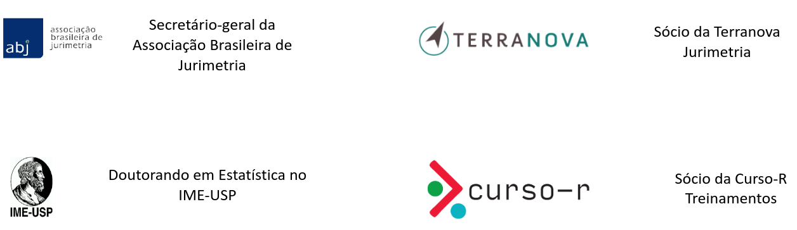
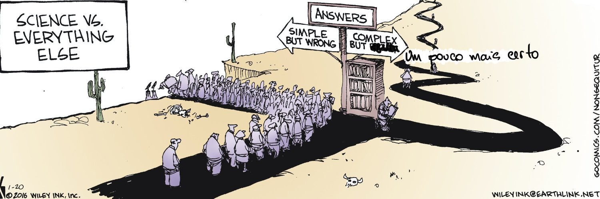
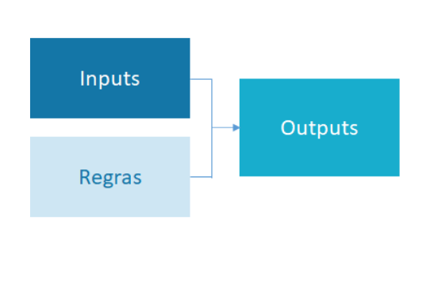
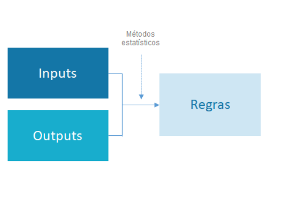
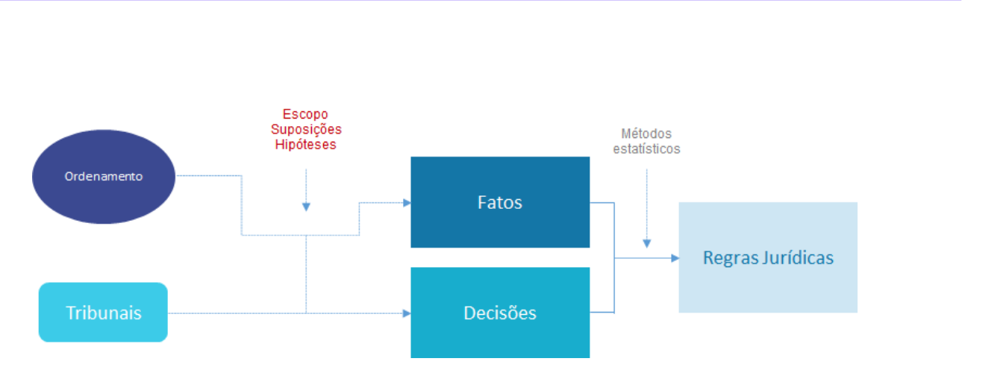
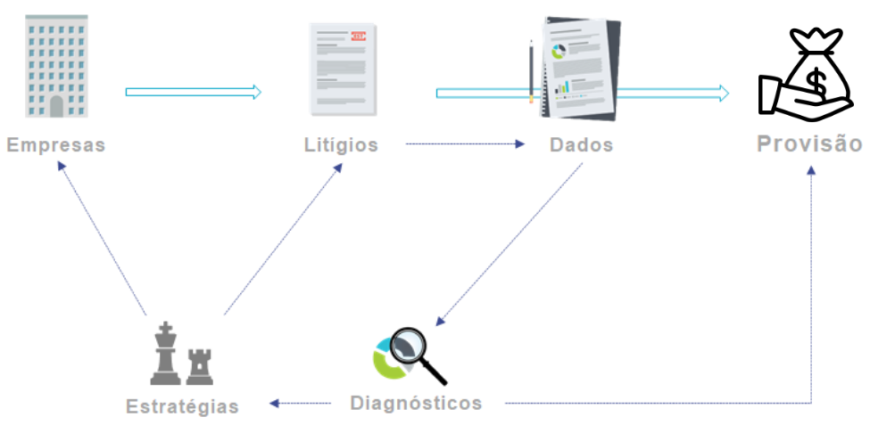

```{r setup, include=FALSE}
knitr::opts_chunk$set(echo = FALSE)
```

---

# Julio Trecenti

Faxineiro de dados

<br/>

<br/>

```{r, out.width="99%"}

```


---
class: center, middle

# Hoje

## [ ] Informações gerais

## [ ] Aspectos práticos

## [ ] Exemplo no R

---
class: inverse, center, middle

# Informações gerais


---

# O que é Jurimetria?

.pull-left[

## Abordagem clássica

- **Abstrata**
- Retrospectiva
- Individual
- Determinística

]

.pull-right[

## Abordagem jurimétrica

- **Concreta**
- Prospectiva
- Populacional
- Estocástica

]

--

```{r, out.width="80%", fig.align="center"}

```

---

# Paradigma programação / aprendizado

.pull-left[

## Programação

<br/>

```{r, out.width="120%"}

```

]

--

.pull-right[

## Aprendizado estatístico

```{r, out.width="120%"}

```

]

---

# Na jurimetria não é diferente


```{r, out.width="125%"}

```


---

# Na jurimetria não é diferente


```{r, out.width="125%"}

```

---
class: center

# Associação Brasileira de Jurimetria

```{r, fig.align="center", out.width="40%"}
knitr::include_graphics("img/logo.png")
```

--

### Reunir e incentivar pesquisadores

--

### Construir a disciplina de jurimetria

--

### Desenvolver estudos aplicados

---

# ABJ ❤️  R

- [abjur](https://github.com/abjur): Organização no GitHub com nossos códigos
- [courtsbr](https://github.com/courtsbr): Organização no GitHub com alguns scrapers

### Pacote [`{abjutils}`](https://github.com/abjur/abjutils)

- Arrumação de textos
- Formatação de números de processos

### Pacotes [`{abjData}`](https://github.com/abjur/abjData) e [`{abjMaps}`](https://github.com/abjur/abjMaps)

- Bases de dados comuns no mundo jurídico
- Relação de comarcas e foros

### Em breve: `{forosCNJ}`

- Códigos das unidades judiciárias

---

# Jurimetria nas empresas

```{r, out.width="100%"}

```


---

# Modelos de consultoria

Consultorias em jurimetria podem oferecer serviços de análise de **dados internos** e **dados externos**.

.pull-left[

## Dados internos


- Mais fáceis de organizar
- Contém informações estratégicas
- Pode ter muitos buracos

]

.pull-right[

## Dados externos

- Mais difíceis de organizar
- Dificilmente contém informação estratégica
- Precisa de grandes esforços de 

]

---
class: center, middle


# A Terranova

Dados, estratégia e ação

```{r, fig.align="center", out.width="60%"}
knitr::include_graphics("img/logo_trnv.png")
```

### Painel de Controle

Controlando os dados internos

### Mapa estratégico

Analisando dados externos

### Parecer jurimétrico

Auxiliando em problemas complexos

---
class: inverse, center, middle

# [x] informações gerais

# [✅ ] aspectos práticos

# [✅ ] exemplo no R
