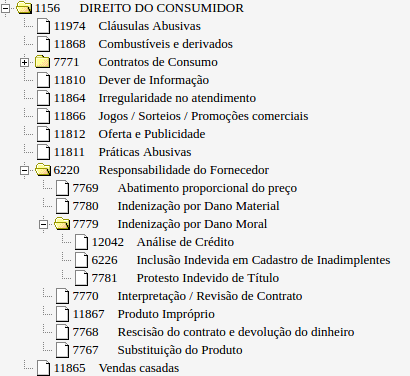
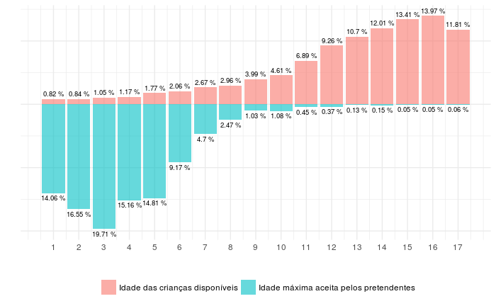
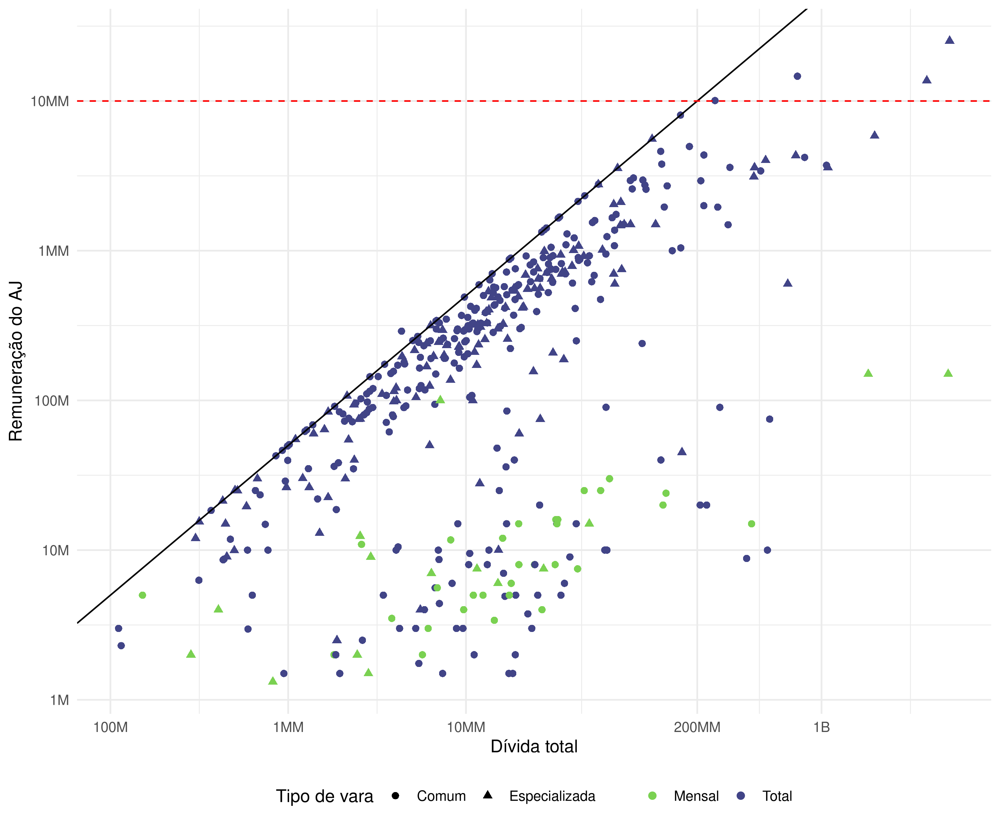
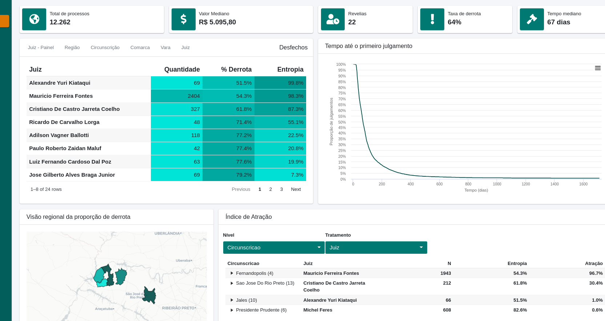

```{r setup, include=FALSE}
knitr::opts_chunk$set(echo = FALSE)
```

# Meu conhecimento sobre Direito

[pollev.com/juliotrecent508](https://pollev.com/juliotrecent508)

<iframe src="https://beta.polleverywhere.com/multiple_choice_polls/YqVmuT0TXlOBz60077JdY", frameborder="0" width = "100%", height = "500px"/>

---

# Onde estão os dados?

### Diários de Justiça

PDFs enormes com tudo o que acontece no judiciário

### Consulta de Jurisprudência

Ferramentas de pesquisa dos tribunais (não é unificado)

### Consulta de processos

Ferramentas de consulta de processos dos tribunais (não é unificado)

---

# Como funciona um processo judicial?

Res. 65 CNJ

# `NNNNNNN-DD.AAAA.J.TT.OOOO`

- `NNNNNNN`: Número
- `DD`: Dígito verificador
- `AAAA`: Ano de distribuição
- `J`: Justiça
- `TT`: Tribunal
- `OOOO`: Unidade judiciária

---

# Como funciona um processo judicial?

```{r, out.width="90%"}

```

---

# Como fazer uma pesquisa em jurimetria

### Escopo regional

- Qual esfera?
- Qual tribunal?
- Quais comarcas?

### Escopo temporal

- Qual intervalo de tempo?
- Qual tribunal?
- Quais comarcas?

### Escopo temático

- Quais tipos de processos?
- Como acessar esses tipos de processos?

---

# Escopo regional

Comarcas, circunscrições, regiões administrativas

```{r, out.width="100%"}
knitr::include_graphics("img/mapa.png")
```

---


# Escopo temporal

Prospectivo, retrospectivo

```{r, out.width="100%"}
knitr::include_graphics("img/tempos.png")
```

---

# Escopo temático

Tabelas processuais unificadas (Res. 46 CNJ)

```{r, out.width="70%", fig.align="center"}

```

---

# Barreiras

```{r, out.width="100%"}

```

Pacote [`decryptr`](https://github.com/decryptr/decryptr).

---

# Principais classes de modelos

### Sobrevivência

Aplicações:

- Tempo dos processos para projeção de carteira
- Tempo dos processos para políticas públicas

### Classificação de decisões

Aplicações:

- Predição de resultados de processos
- Avaliação de risco de carteiras

### Textos e imagens (Deep Learning)

Aplicações:

- Extração de dados de petições iniciais
- Agrupamento de textos

---
class: center, middle

# Cases

---

# Políticas públicas

```{r, out.width="100%"}

```

---

# Observatório

```{r, out.width="100%"}

```

---

# Mapa estratégico

```{r, out.width="100%"}

```

---

# Notícias quentes

### DataJud

```{r, out.width="50%"}

```

### Análise de Impacto Regulatório

Decreto [10.411/2020](https://www.in.gov.br/en/web/dou/-/decreto-n-10.411-de-30-de-junho-de-2020-264424798)

---
class: inverse, center, middle

# [x] informações gerais

# [x] aspectos práticos

# [✅ ] exemplo no R
